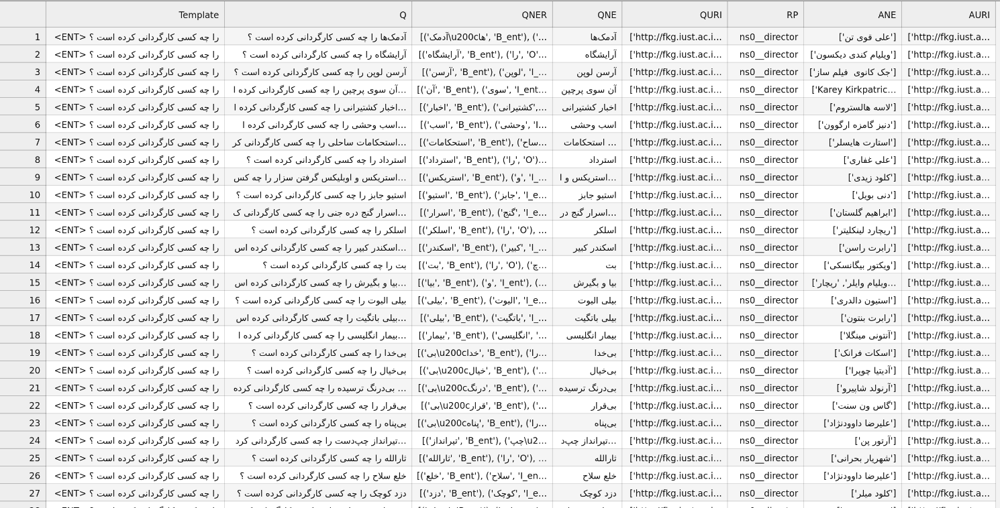
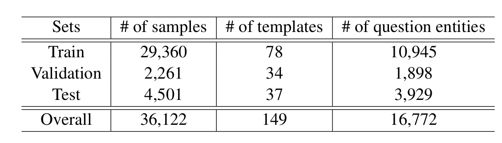

# ParsSimpleQA: The Persian Simple Question Answering Dataset and System over Knowledge Graph
**Accepted in AACL 2022**
> Hamed Babaei Giglou, Niloufar Beyranvand, Reza Moradi, Amir Mohammad Salehoof, and Saeed Bibak \
> Natural Language Processing Department, Part AI Research Center, Tehran, Iran

The simple question answering over the knowledge graph concerns answering single-relation questions by querying the facts in the knowledge graph. This task has drawn significant attention in recent years. However, there is a demand for a simple question dataset in the Persian language to study open-domain simple question answering. In this paper, we present the first Persian single-relation question-answering dataset and a model that uses a knowledge graph as a source of knowledge to answer questions. We create the ParsSimpleQA dataset semi-automatically in two steps. First, we build single-relation question templates. Next, we automatically create simple questions and answers using templates, entities, and relations from Farsbase. To present the reliability of the presented dataset, we proposed a simple question-answering system that receives questions and uses deep learning and information retrieval techniques for answering questions. The experimental results presented in this paper show that the ParsSimpleQA dataset is very promising for the Persian simple question-answering task.

## Dataset Details

The following is the screenshot from the dataset:




The dataset columns are representative of the followings:

* `Template` (`string`): A template for question generation.
* `Q` (`string`): Generated question using subject entity.
* `QNER` (`list`): Question entity labels for subject entity identification for named entity recognition (NER) task.
* `QNE` (`string`): Question subject entity.
* `QURI` (`list`): Question subject entity URIs.
* `RP` (`string`): Question single-relation type for relation prediction (RP) task.
* `ANE` (`list`): Question answers (object entity).
* `AURI` (`list`): Question answers (object entity) URIs


The dataset stats are as follows:



## Acknowledgements
This work was funded by [Part AI Research Center](http://partdp.ai) for digital humanities. This dataset is openly available for **research purposes**. To obtain a complete version of this dataset please email us via [info@partdp.ai](info@partdp.ai).
<!-- 
## Citation
If you are using this work. Please cite us as:
```

``` -->
